# Tugas Besar Matriks dan Ruang Vektor

Membuat sebuah program yang dapat menyelesaikan Sistem Persamaan Linier (SPL) dengan menggunakan metode Eliminasi Gauss dan Eliminasi Gauss-Jordan dengan menggunakan bahasa pemrograman Python.

Dengan menggunakan metode Eliminasi Gauss Jordan program ini dapat mencari solusi dari beberapa persoalan, yaitu:
- SPL yang memiliki solusi unik, dan menampilkan solusinya.
- SPL yang memiliki solusi tak terbatas, dan menampilkan solusinya dalam bentuk parameter.
- SPL yang tidak memiliki solusi, dengan menampilkan "Tidak ada solusi."

## How to run?

1. Pertama, buka command prompt.
2. Kedua, pastikan drive berada di drive C:, jika belum gunakan command di bawah ini.
```
C:
```
3. Ketiga, pastikan directory berada di file \program\, jika belum gunakan command di bawah ini.
```
cd Matvek_Tubes_Kelompok08\src
```
4. Jalankan program main dengan menggunakan command di bawah ini.
```
main.py
```

## Menu Program

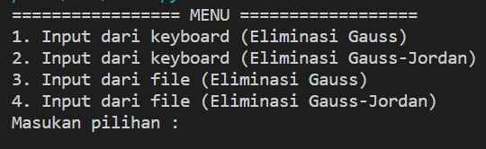

Setelah program dijalankan, program akan menampilkan sebuah menu utama. Menu-menu tersebut diantaranya:
================= MENU ==================
1. Input dari keyboard (Eliminasi Gauss)       
2. Input dari keyboard (Eliminasi Gauss-Jordan)
3. Input dari file (Eliminasi Gauss)
4. Input dari file (Eliminasi Gauss-Jordan)

## MENU: Input dari Keyboard (Eliminasi Gauss)

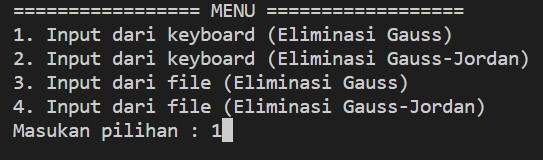
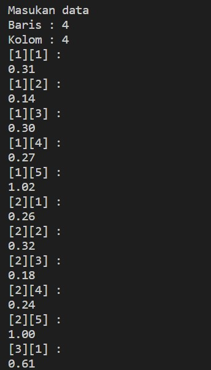
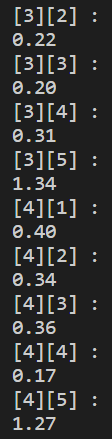

Saat pengguna memilih menu ini, program akan meminta pengguna untuk memasukkan banyak baris dan kolom. Lalu, pengguna juga akan diminta memasukkan nilai x1,x2,x3, ... dan seterusnya. Setelah pengguna menginputkan nilai SPL, selanjutnya secara otomatis pengguna akan diperlihatkan hasil SPL dan bentuk matriks augmented dari SPL tersebut. Setelah program selesai, program akan secara langsung memproses matriks augmented tadi ke dalam bentuk matriks eselon baris dan menampilkannya ke layar


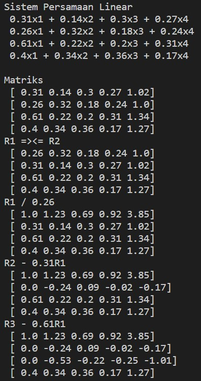
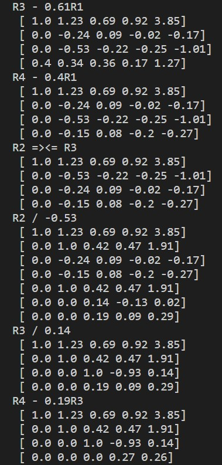
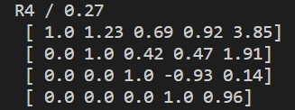

## MENU: Input dari Keyboard (Eliminasi Gauss-Jordan)

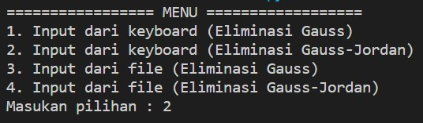


Saat pengguna memilih menu ini, program akan meminta pengguna untuk memasukkan banyak baris dan kolom. Lalu, pengguna juga akan diminta memasukkan nilai x1,x2,x3, ... dan seterusnya. Setelah pengguna selesai memasukkan nilai, program akan secara langsung menampilkan SPL dan mengubahnya ke dalam matriks augmented lalu diubah kembali ke dalam bentuk matriks eselon baris tereduksi dan menampilkan solusi dari SPL tersebut yaitu menampilkan nilai x1,x2,x3 dan x4. 

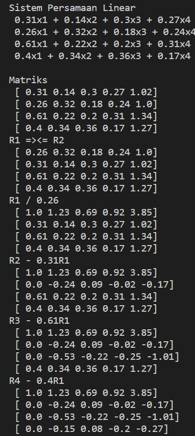
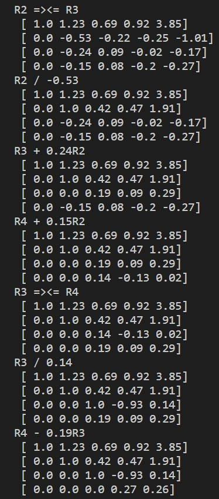
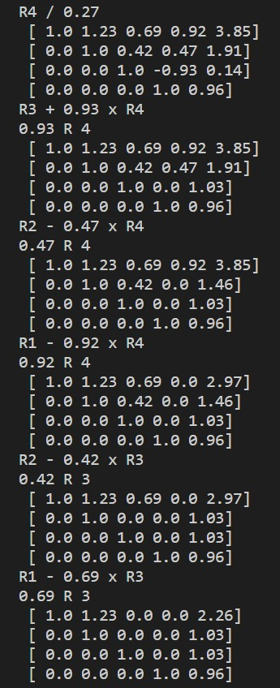
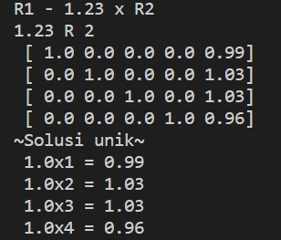

## MENU: Input dari file (Eliminasi Gauss)

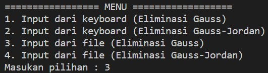


Saat pengguna memilih menu ini (pilihan 3), maka program akan menggunakan nilai dari file yang sudah diimpor yakni file coba, Dengan mengakses nilai dari Matrix (List matriks), ManyRow(Banyak baris), dan ManyKolom(Banyak kolom) user tak perlu menginputkan nilai secara manual. Setelah itu, program akan mengolah nilai dari list menjadi sebuah matrix augmented dan ditampilkan, setelah itu diproses dengan eliminasi Gauss dan ditampilkan bentuk akhir matriks yaitu matriks eselon baris.

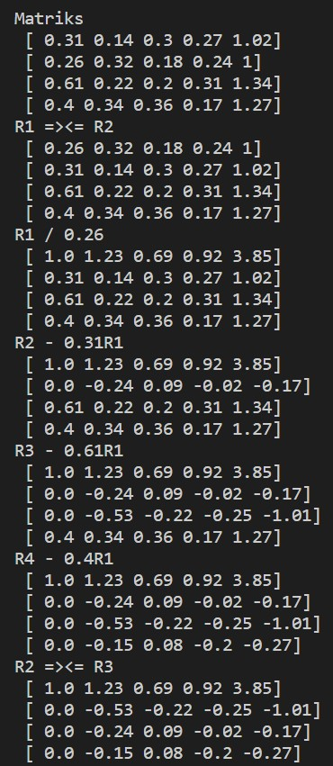
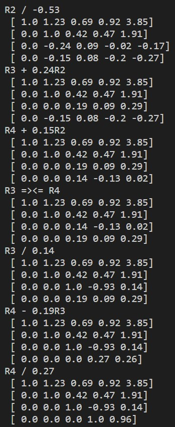

## MENU: Input dari file (Eliminasi Gauss-Jordan)

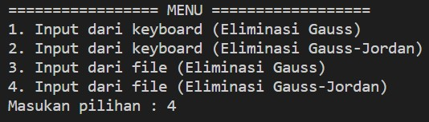


Dalam percobaan keempat kita akan mencoba pilihan 4. Sama seperti percobaan ketiga program akan mengambil nilai dari variabel Matrix (list matriks), ManyRow (banyak baris) dan ManyKolom (banyak kolom) dari file coba. Setelah program mengambil nilai dari file coba, lalu dengan otomatis program akan menampilkan bentuk matriks augmented dan secara langsung akan memproses ke dalam bentuk matriks eselon baris tereduksi dan menampilkan solusi dari SPL tersebut yaitu menampilkan nilai x1,x2,x3 dan x4. 

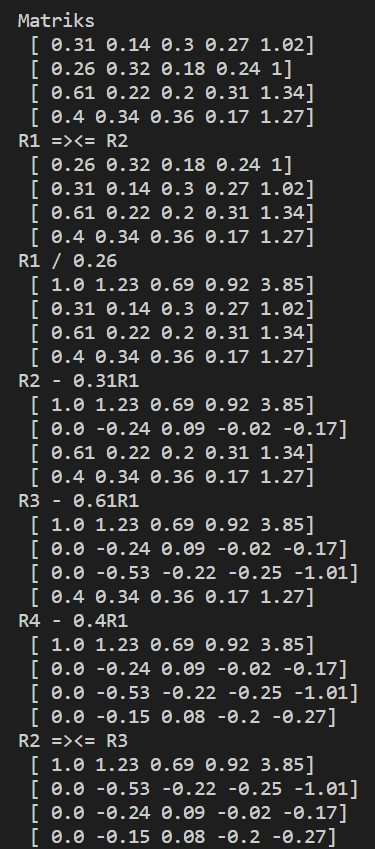
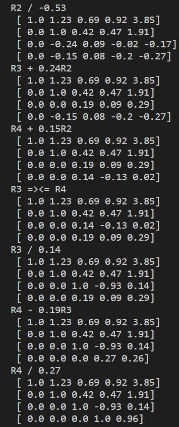
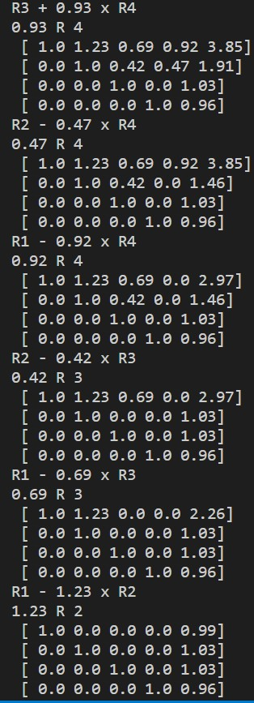
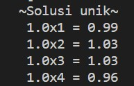

## Kesimpulan

Pada program sederhana ini penyelesaian masalah metode eliminasi gauss hanya dapat menyelesaikan SPL nya saja tidak dengan solusinya sedangkan metode eliminasi gauss jordan dapat menyelesaikan SPL dan memiliki solusi